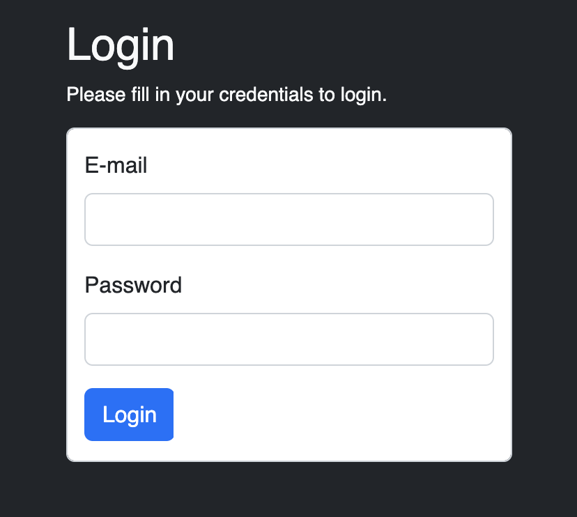

# Cinema Theater

This project was based around a SQL database filled with dummy data about a cinema theater and its members. So I built this website so that registered members could :
- Log in, look up movies by name, genre, distributor. 
- Access their profile and edit their name. 
- Subscribe orunsubscribe to a premium membership
- Check their or another member's history
- Check what movies seances are programmed at a given date.

There is also an admin access for the cinema theater executive staff, so they can:
- Edit member info
- Edit staff info
- Changer their subscription plan
- Plan a new movie seance

It is my first ever fully functional website (with a back-end and a front-end). And my first CRUD ever ! All in vanilla JavaScript and PHP with PDO MySQL.

### Project restrictions
- Plain PHP and JavaScript

### Things I learned making this project
- Bootstrap CSS
- PDO connexion
- SQL queries
- AJAX requests for fetching data
- Functional Pagination

### Pre-requisites
PHP installed, a local Apache/Nginx server as well as MySQL

## Installation
Clone the repo to get started.

Import the my_cinema.sql database into your MySQL.
Edit the $servername, $username, $password and $dbname variables in connection.php.
Launch your local server.

If everything is configured correctly, you should see this login screen

Here are two users credentials to allow you to navigate the website
| Role | Email | Password |
|------|-------|----------|
| Admin | randy.black@ore.com | admin |
| User | jeffrey.wheeler@ota.com | user |

As it is dummy data, all executives' password is "admin" and all users' password is "user".

Have fun navigating the website !

## License
MIT